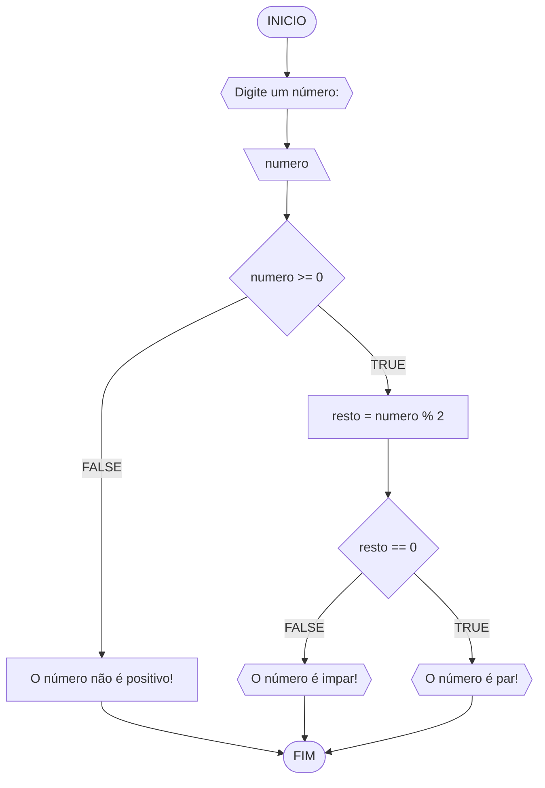
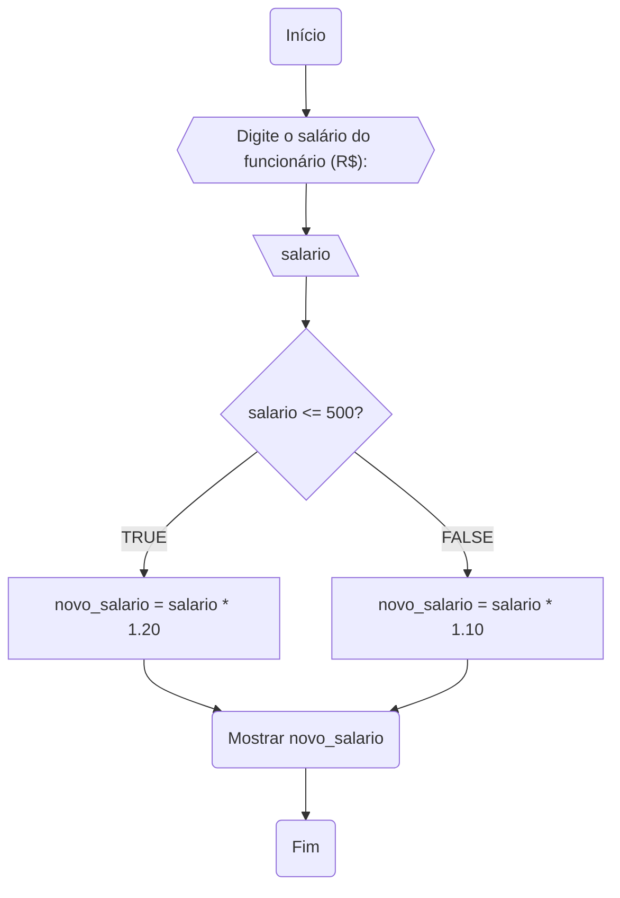
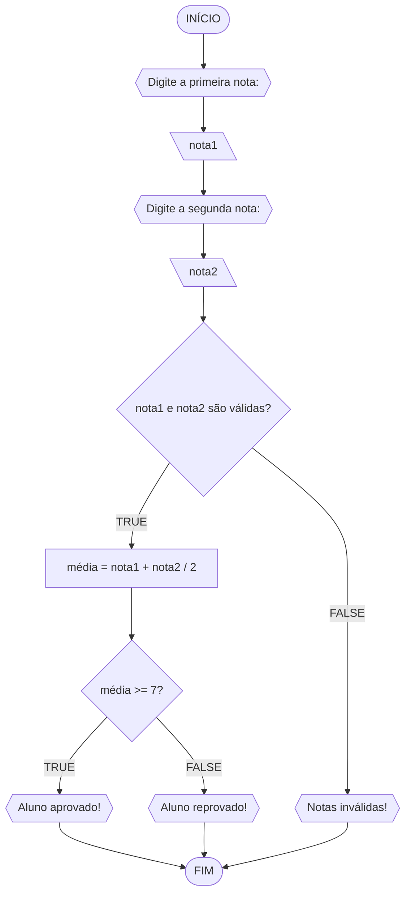
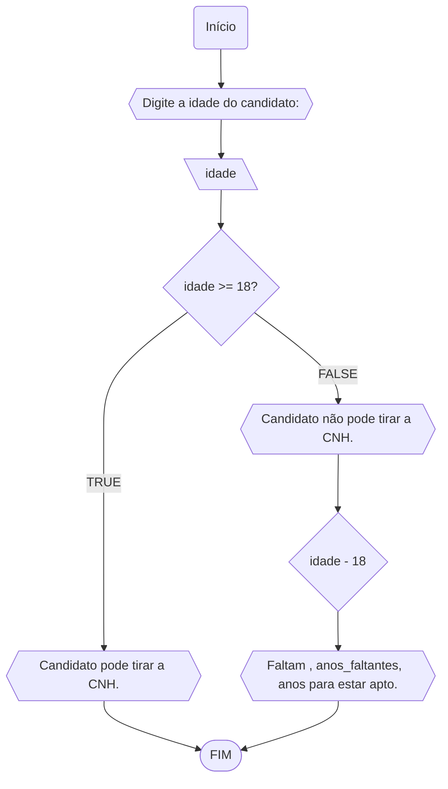

# UNIFOR
**Nome**: Samuel Menezes <br>
**Disciplina**: Raciocínio lógico algorítmico

## Lista de exercícios 01

### Exercício 01 (1 ponto)
Represente, em fluxograma e pseudocódigo, um algoritmo para determinar se um número inteiro e positivo é par ou impar.

#### Fluxograma (0,25 ponto)



#### Pseudocódigo (0,5 ponto)
```
1  ALGORTIMO verifica_par_impar
2  DECLARE numero, resto: INTEIRO
3  ESCREVA "Digite um número: "
4  INICIO
4  LEIA numero
5  SE numero >= 0 ENTAO                  // verifica se o inteiro é positivo
6    resto = numero % 2                 // calcula o resto da divisão por 2
7    SE resto == 0 ENTAO                // verifica se o resto é igual a zero
8      ESCREVA "O número é par!"
9    SENAO
10     ESCREVA "O número é impar!"
11   FIM_SE
11  SENAO                                // caso inteiro for negativo (condição linha 5)
12    ESCREVA "O número deve ser postivo!"
13  FIM_SE
13 FIM
```

#### Teste de mesa (0,25 ponto)
| numero | numero >= 0 | resto | resto == 0 | Saída |
| -- | -- | -- | -- | -- | 
| -1 | F |   |   | "O número deve ser postivo!" |
| 0  | V | 0 | V | "O número é par!" |
| 13 | V | 1 | F | "O número é impar!" |
| 30 | V | 0 | V | "O número é par!" |

## Exercício 02 (3 pontos)
Represente, em fluxograma e pseudocódigo, um algoritmo para calcular o novo salário de um funcionário. 
Sabe-se que os funcionários que recebem atualmente salário de até R$ 500 terão aumento de 20%; os demais terão aumento de 10%.

#### Fluxograma (1.0 ponto)



#### Pseudocódigo (1.0 ponto)

```
Algoritmo ContaAprovacoes
INÍCIO
    Escreva "Digite o salário do funcionário (R$):"
    Leia salario

    SE salario <= 500 ENTAO
        novo_salario = salario * 1.20
    SENÃO
        novo_salario = salario * 1.10
    FIM SE

    Escreva "Novo salário do funcionário: ", novo_salario
FIM

```

#### Teste de mesa (1.0 ponto)

| Entrada                     | Saída                          |
|-----------------------------|--------------------------------|
| Salário do funcionário (R$) | Novo salário do funcionário:   |
| R$ 600                      | R$ 660                         |

## Exercício 03 (3 pontos)
Represente, em fluxograma e pseudocódigo, um algoritmo para calcular a média aritmética entre duas notas de um aluno e mostrar sua situação, que pode ser aprovado ou reprovado.

#### Fluxograma (1 ponto)



#### Pseudocódigo (1 ponto)

```
Algoritmo ContaAprovacoes
INÍCIO
    Escreva "Digite a primeira nota: "
    Leia nota1
    Escreva "Digite a segunda nota: "
    Leia nota2

    SE nota1 e nota2 são válidas ENTAO
        média = (nota1 + nota2) / 2

        SE média >= 7 ENTAO
            Escreva "Aluno aprovado!"
        SENÃO
            Escreva "Aluno reprovado!"
        FIM SE
    SENÃO
        Escreva "Notas inválidas!"
    FIM SE

FIM

```

#### Teste de mesa (1 ponto)

| Passo         | Entrada/Saída                         | Variáveis/Valores          | 
|---------------|---------------------------------------|----------------------------| 
| 1             | Entrada                               |                            |
| 2             | Digite a primeira nota:               |                            |
|               |                                       |                            |
| 3             | Entrada                               | nota1                      |
| 4             | Digite a segunda nota:                |                            |
|               |                                       |                            |
| 5             | Entrada                               | nota2                      |
| 6             | Verifica se nota1 e nota2 são válidas | nota1, nota2               |
|               |                                       |                            |
| 7             | Se verdadeiro                         |                            |
| 8             | Cálculo da média                      | média = (nota1 + nota2)/2  |
| 9             | Verifica se média >= 7                | média                      |
| 10            | Se verdadeiro                         |                            |
| 11            | Saída                                 | "Aluno aprovado!"          |
| 12            | Fim                                   |                            |
| 10            | Se falso                              |                            |
| 11            | Saída                                 | "Aluno reprovado!"         |
| 12            | Fim                                   |                            |
| 7             | Se falso                              |                            |
| 8             | Saída                                 | "Notas inválidas!"         |
| 9             | Fim                                   |                            |

## Exercício 04 (3 pontos)
Represente, em fluxograma e pseudocódigo, um algoritmo que, a partir da idade do candidato(a), determinar se pode ou não tirar a CNH. 
Caso não atender a restrição de idade, calcular quantos anos faltam para o candidato estar apto.

#### Fluxograma (1.0 ponto)



#### Pseudocódigo (1.0 ponto)

```
Algoritmo ContaAprovacoes
INÍCIO
    Escreva "Digite a idade do candidato: "
    Leia idade

    SE idade >= 18 ENTAO
        Escreva "Candidato pode tirar a CNH."
    SENÃO
        anos_faltantes = idade - 18
        Escreva "Candidato não pode tirar a CNH."
        Escreva "Faltam ", anos_faltantes, " anos para estar apto."
    FIM SE

FIM

```

#### Teste de mesa (1.0 ponto)

| Passo         | Entrada/Saída                         | Variáveis/Valores         | 
|---------------|---------------------------------------|----------------------------| 
| 1             | Entrada                               |                            |
| 2             | Digite a idade do candidato:          |                            |
|               |                                       |                            |
| 3             | Entrada                               | idade                      |
| 4             | Verifica se idade >= 18               | idade                      |
|               |                                       |                            |
| 5             | Se verdadeiro                         |                            |
| 6             | Saída                                 | "Candidato pode tirar a CNH." |
| 7             | Fim                                   |                            |
| 5             | Se falso                              |                            |
| 6             | Cálculo dos anos faltantes            | anos_faltantes = 18 - idade |
| 7             | Saída                                 | "Candidato não pode tirar a CNH." |
| 8             | Saída                                 | "Faltam ", anos_faltantes, " anos para estar apto." |
| 9             | Fim                                   |                            |
