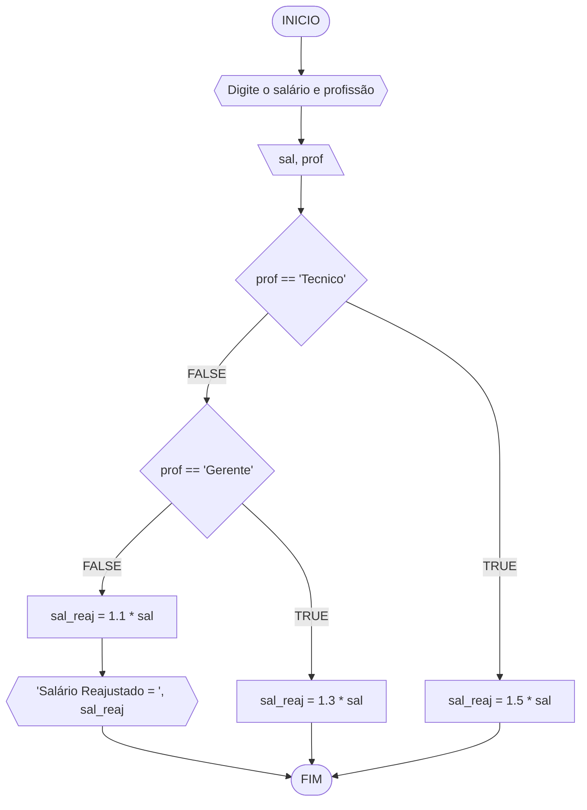
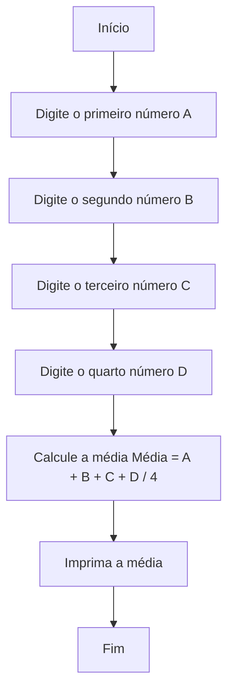
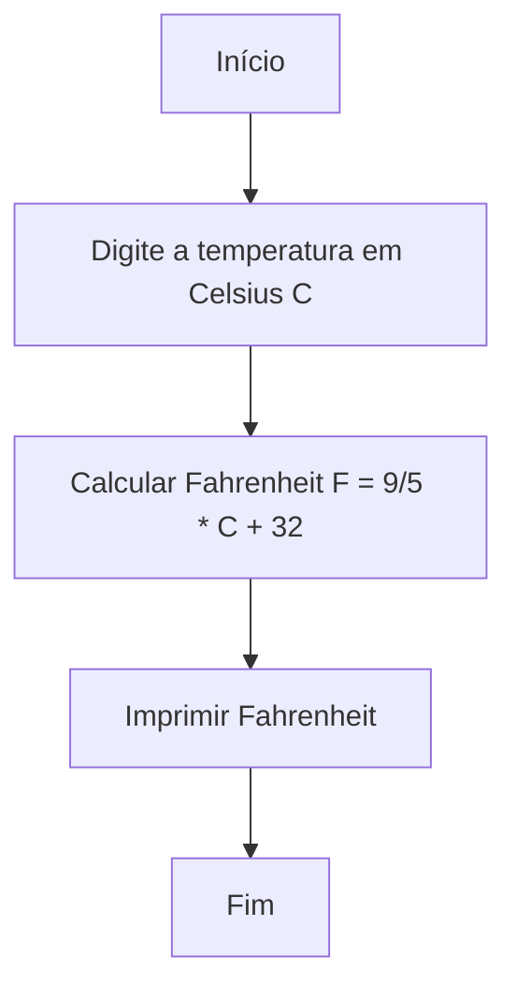
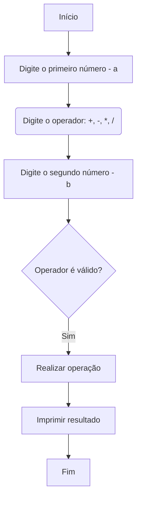
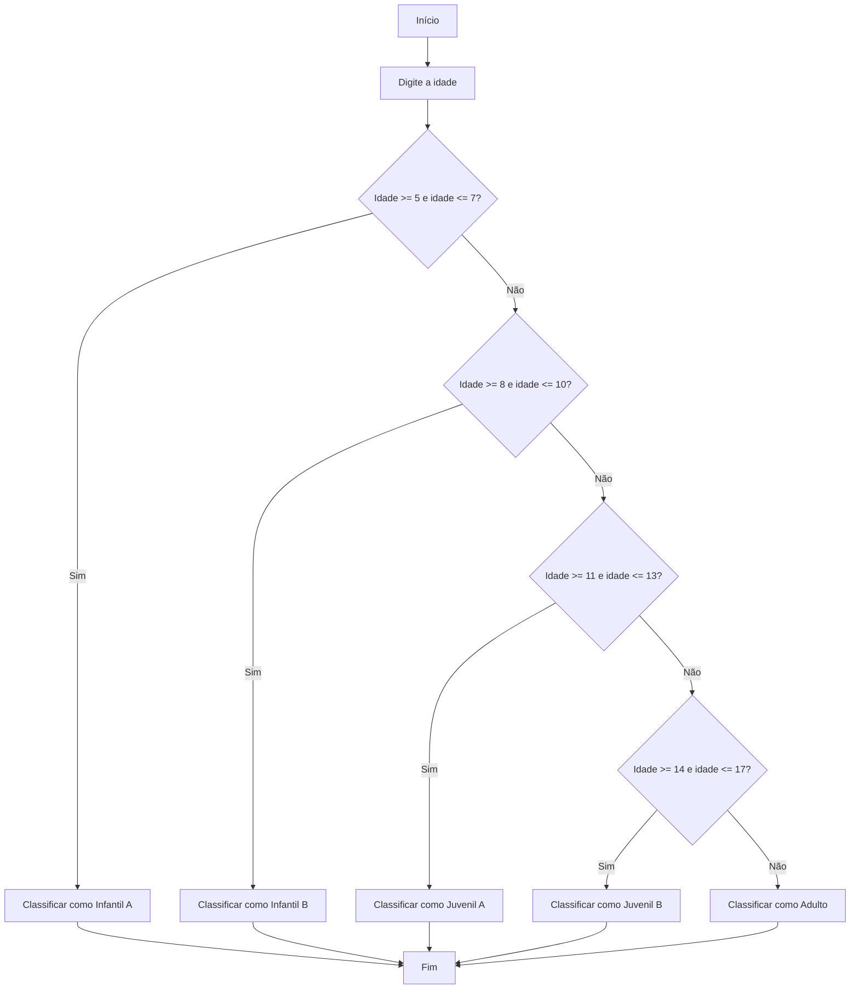

# UNIFOR
**Nome**: Samuel Menezes <br>
**Disciplina**: Raciocínio lógico algorítm

## Exercício exemplo
Represente, em fluxograma e pseudocódigo, um algoritmo para calcular o adicional de salário de funcionário por cargo de uma empresa fictícia. Sabe-se que os funcionários de cargo técnico receberão reajuste de 50%, cargo de gerência, um reajuste de 30% e demais, um reajuste de 10%. 

#### Fluxograma


#### Pseudocódigo
```
1  ALGORITMO calReajuste
2  DECLARE  sal, sal_reaj: real, prof: caractere
3  INICIO
4  LEIA sal, prof
5  ESCOLHA
6   CASO prof == “Técnico”		// caso 1
7     sal_reaj ← 1.5 * sal
8   CASO prof = “Gerente”		// caso 2
9     sal_reaj ← 1.3 * sal
10  SENÃO
11    sal_reaj ← 1.1 * sal
12 FIM_ESCOLHA
13 ESCREVA “Salário Reajustado = “, sal_reaj
14 FIM
```

#### Teste
| sal | prof | prof == “Técnico” | prof = “Gerente” | sal_reaj | Saída |
| -- | -- | -- | -- | -- | -- |
| 1000 | Técnico | V | F | 1500 | “Salário Reajustado = 1500“ |
| 2000 | Gerente | F | V | 2600 | “Salário Reajustado = 2600“ |
| 9000 | Diretor | F | F | 9900 | “Salário Reajustado = 9900“ |

## Lista de exercícios 02

### Exercício 01 (2.5 pontos)
Calcule a média de quatro números inteiros dados.

#### Fluxograma (1.0 ponto)



#### Pseudocódigo (1.0 ponto)

```
Algoritmo Media
Início
    Escrever "Digite o primeiro número (A):"
    Ler A
    Escrever "Digite o segundo número (B):"
    Ler B
    Escrever "Digite o terceiro número (C):"
    Ler C
    Escrever "Digite o quarto número (D):"
    Ler D
    Média = (A + B + C + D) / 4
    Escrever "A média é:", Média
Fim

```

#### Teste de mesa (0.5 ponto)

| Etapa | Descrição                            | Dados/Resultado |
|-------|--------------------------------------|------------------|
| Início|                                      |                  |
| Passo 1| Digite o primeiro número (A)        |  A= 5            |
| Passo 2| Digite o segundo número (B)         | B = 7            |
| Passo 3| Digite o terceiro número (C)        | C = 4            |
| Passo 4| Digite o quarto número (D)          | D = 10           |
| Passo 5| Calcule a média (Média = A + B + C + D / 4) | Média = (5 + 7 + 4 + 10) / 4 = 6.5 |
| Passo 6| Imprima a média                     | Média = 6.5      |
| Passo 7| Fim                                 |                  |


### Exercício 02 (2.5 pontos)
Leia uma temperatura dada em Celsius (C) e imprima o equivalente em Fahrenheit (F). (Fórmula de conversão: F = (9/5) * C + 32)

#### Fluxograma (1.0 ponto)



#### Pseudocódigo (1.0 ponto)

```
Algoritmo ConverteCelsiusFarenheit
Início
    Leia temperatura_em_celsius
    Fahrenheit = (9/5) * temperatura_em_celsius + 32
    Imprimir Fahrenheit
Fim

```

#### Teste de mesa (0.5 ponto)

| Etapa        | Descrição                                | Dados/Resultado     | 
|--------------|------------------------------------------|----------------------| 
| Início       |                                          |                      | 
| Passo 1      | Digite a temperatura em Celsius (C)      |                      | 
| Passo 2      | Calcular Fahrenheit (F = 9/5 * C + 32)   |                      | 
| Passo 3      | Imprimir Fahrenheit                      | Fahrenheit = 77      | 
| Passo 4      | Fim                                      |                      | 


### Exercício 03 (2.5 pontos)
Receba dois números reais e um operador e efetue a operação correspondente com os valores recebidos (operandos). 
O algoritmo deve retornar o resultado da operação selecionada simulando todas as operações de uma calculadora simples.

#### Fluxograma (1.0 ponto)



#### Pseudocódigo (1.0 ponto)

```
Algoritmo Calculadora
Início
    Escrever "Digite o primeiro número - a:"
    Ler a
    Escrever "Digite o operador: +, -, *, /:"
    Ler operador
    Escrever "Digite o segundo número - b:"
    Ler b
    
    Se operador é válido Então
        Se operador = "+" Então
            resultado = a + b
        Senão Se operador = "-" Então
            resultado = a - b
        Senão Se operador = "*" Então
            resultado = a * b
        Senão Se operador = "/" E b != 0 Então
            resultado = a / b
        Senão
            Escrever "Operador inválido"
            Retornar
        Fim Se
    Senão
        Escrever "Operador inválido"
        Retornar
    Fim Se
    
    Escrever "O resultado é:", resultado
Fim

```

#### Teste de mesa (0.5 ponto)

| Etapa | Descrição                              | Dados/Resultado |
|-------|----------------------------------------|------------------|
| Início|                                        |                  |
| Passo 1| Digite o primeiro número - a:         | a = 10           |
| Passo 2| Digite o operador: +, -, *, /:        | operador = "+"   |
| Passo 3| Digite o segundo número - b:          | b = 5            |
| Passo 4| Verificar operador válido:            | Sim              |
| Passo 5| Realizar operação:                    | resultado = 15   |
| Passo 6| Imprimir resultado:                   | 15               |
| Passo 7| Fim                                   |                  |


### Exercício 04 (2.5 pontos)
Elaborar um algoritmo que, dada a idade, classifique nas categorias: infantil A (5 - 7 anos), infantil B (8 -10 anos), juvenil A (11 - 13 anos), juvenil B (14 -17 anos) e adulto (maiores que 18 anos).

#### Fluxograma (1.0 ponto)



#### Pseudocódigo (1.0 ponto)

```
Algoritmo ClassificaCategoria
Início
    Escrever "Digite a idade:"
    Ler idade
    
    Se idade >= 5 E idade <= 7 Então
        Escrever "Classificar como Infantil A"
    Senão Se idade >= 8 E idade <= 10 Então
        Escrever "Classificar como Infantil B"
    Senão Se idade >= 11 E idade <= 13 Então
        Escrever "Classificar como Juvenil A"
    Senão Se idade >= 14 E idade <= 17 Então
        Escrever "Classificar como Juvenil B"
    Senão
        Escrever "Classificar como Adulto"
    Fim Se
Fim

```

#### Teste de mesa (0.5 ponto)

| Etapa | Descrição                              | Dados/Resultado |
|-------|----------------------------------------|------------------|
| Início|                                        |                  |
| Passo 1| Digite a idade:                       | idade = 12       |
| Passo 2| Verificar idade entre 5 e 7 anos?     | Sim              |
| Passo 3| Verificar idade entre 8 e 10 anos?    | Não              |
| Passo 4| Verificar idade entre 11 e 13 anos?   | Sim              |
| Passo 5| Verificar idade entre 14 e 17 anos?   | Não              |
| Passo 6| Classificar como Juvenil A            |                  |
| Passo 7| Fim                                   |                  |
