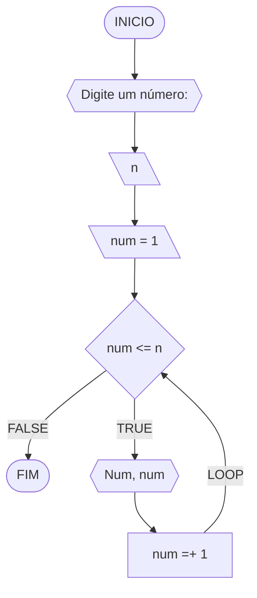
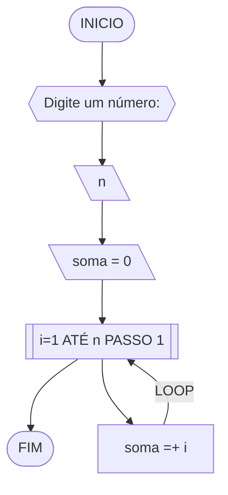
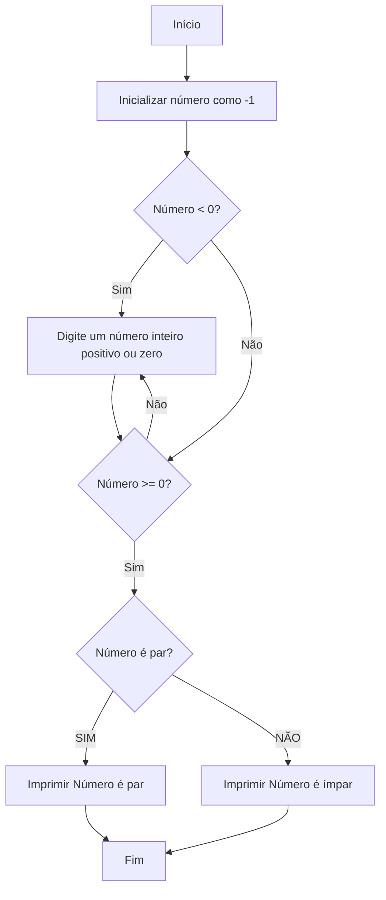
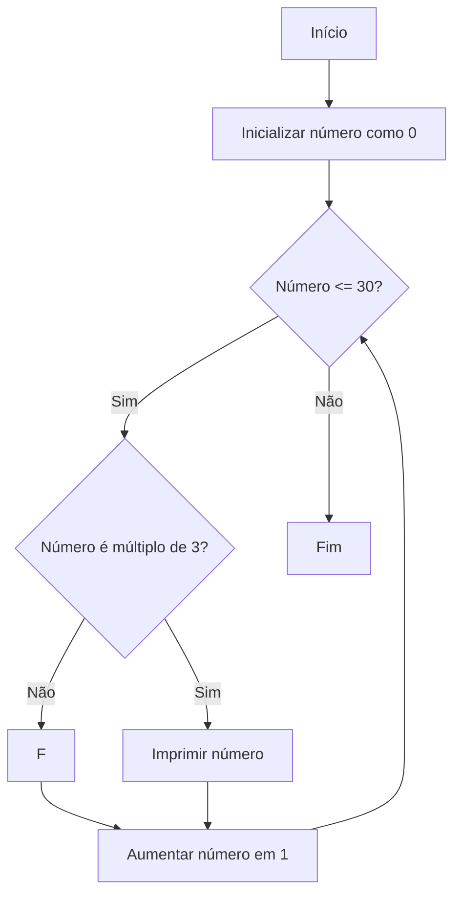
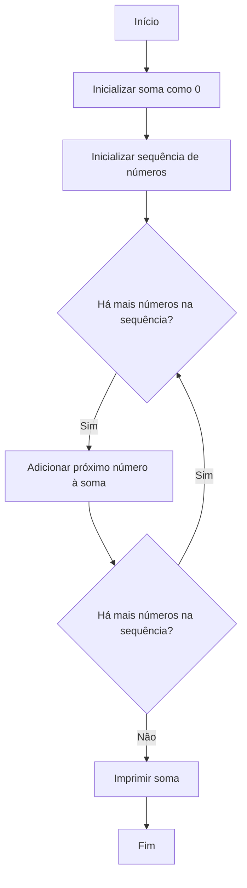
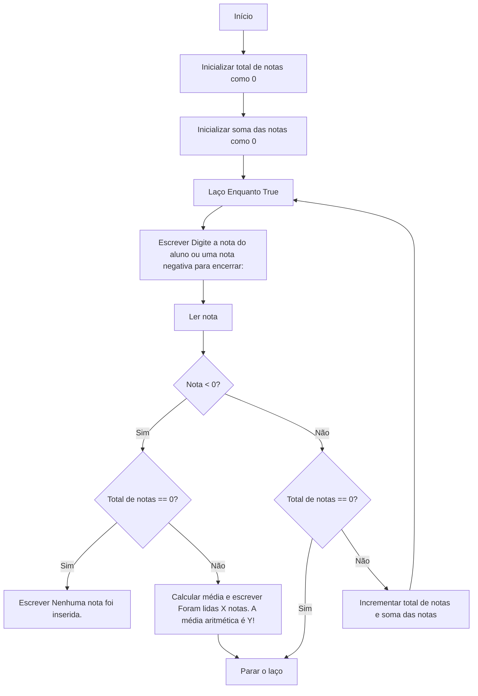

# UNIFOR
**Nome**: Samuel Menezes <br>
**Disciplina**: Raciocínio lógico algorítmico

## Exercício exemplo 1
Implemente e teste um programa que imprima os n primeiros números.

#### Fluxograma


#### Pseudocódigo
```
1 ALGORITMO print_n_primeiros
2 DECLARE n, num: INTEIRO
3 INICIO
4 ESCREVA “Digite um número: ”
4 LEIA n			// variável de entrada n
4 num ← 1			// variável num inicializada
5 ENQUANTO num <= n FAÇA	// n iterações
7	ESCREVA “Número ”, num
8	num ← num + 1		// num =+ 1 (incremento)
8 FIM_ENQUANTO
9 FIM
```

#### Teste de mesa
| it | n  | num | num <= n | Saída      | num =+ 1 |
| -- | -- | --  | --       | --         | --       |
| 1  | 10 | 1   | True     | Número 1   | 2        |
| 2  | 10 | 2   | True     | Número 2   | 3        |
| 3  | 10 | 3   | True     | Número 3   | 4        |
| 4  | 10 | 4   | True     | Número 4   | 5        |
| 5  | 10 | 5   | True     | Número 5   | 6        |
| 6  | 10 | 6   | True     | Número 6   | 7        |
| 7  | 10 | 7   | True     | Número 7   | 8        |
| 8  | 10 | 8   | True     | Número 8   | 9        |
| 9  | 10 | 9   | True     | Número 9   | 10       |
| 10 | 10 | 11  | True     | Número 10  | 11       |
| 11 | 10 | 11  | False    |            |          |

## Exercício exemplo 2
Implemente e teste um programa que some os n primeiros números.

#### Fluxograma


#### Pseudocódigo
```
1  ALGORITMO	soma_n_numeros()
2  DECLARE	n, i, soma: INTEIRO
3  INICIO
4  ESCREVA “Digite a quantidade de números: ”
5  LEIA n		// variável de entrada n
7  soma ← 0		// variável soma inicializada
6  PARA i DE 1 ATÉ n PASSO 1 FAÇA
7	soma ← soma + i	// soma =+ i (incremento)
8  FIM_PARA
9  ESCREVA “A soma é igual a ”, soma
10 FIM
```

#### Teste de mesa
| it | n  | soma | i  | soma =+ i |
| -- | -- | --   | -- | --        |
| 1  | 10 | 0    | 1  | 1         |
| 2  | 10 | 1    | 2  | 3         |
| 3  | 10 | 3    | 3  | 6         |
| 4  | 10 | 6    | 4  | 10        |
| 5  | 10 | 10   | 5  | 15        |
| 6  | 10 | 15   | 6  | 21        |
| 7  | 10 | 21   | 7  | 28        |
| 8  | 10 | 28   | 8  | 36        |
| 9  | 10 | 36   | 9  | 45        |
| 10 | 10 | 45   | 10 | 55        | 

## Lista de exercícios 03

### Exercício 01 (2.5 pontos)
Atualize o algoritmo para determinar se um número inteiro e positivo é par ou ímpar, usando uma laço condicional para aceitar apenas números maiores ou iguais a zero. 

#### Fluxograma (1.0 ponto)



#### Pseudocódigo (1.0 ponto)

```
Algoritmo ClassificaCategoria
Início
    número <- -1
    Enquanto número < 0 Faça
        Escrever "Digite um número inteiro positivo ou zero:"
        Ler número
        Se número < 0 Então
            Escrever "Número inválido. Digite um número inteiro positivo ou zero."
        Fim Se
    Fim Enquanto
    
    Se número % 2 == 0 Então
        Escrever "Número é par."
    Senão
        Escrever "Número é ímpar."
    Fim Se
Fim

```

#### Teste de mesa (0.5 ponto)

Este é do número par:

| Etapa | Descrição                                        | Dados/Resultado |
|-------|--------------------------------------------------|------------------|
| Início|                                                  |                  |
| Passo 1| Inicializar número como -1                      | número = -1      |
| Passo 2| Verificar se número < 0                         | Sim              |
| Passo 3| Digitar um número inteiro positivo ou zero      | número = 10      |
| Passo 4| Verificar se número >= 0                        | Sim              |
| Passo 5| Verificar se número é par                       | Sim              |
| Passo 6| Imprimir "Número é par."                        |                  |
| Passo 7| Fim                                             |                  |

Este é do número impar:

| Etapa | Descrição                                        | Dados/Resultado |
|-------|--------------------------------------------------|------------------|
| Início|                                                  |                  |
| Passo 1| Inicializar número como -1                      | número = -1      |
| Passo 2| Verificar se número < 0                         | Sim              |
| Passo 3| Digitar um número inteiro positivo ou zero      | número = 7       |
| Passo 4| Verificar se número >= 0                        | Sim              |
| Passo 5| Verificar se número é par                       | Não              |
| Passo 6| Imprimir "Número é ímpar."                      |                  |
| Passo 7| Fim                                             |                  |


### Exercício 02 (2.5 pontos)
Faça um algoritmo que exiba na tela uma contagem de 0 até 30, exibindo apenas os múltiplos de 3.

#### Fluxograma (1.0 ponto)



#### Pseudocódigo (1.0 ponto)

```
Algoritmo ClassificaCategoria
Início
    Para cada número de 0 até 30 Faça
        Se número % 3 == 0 Então
            Escrever número
        Fim Se
    Fim Para
Fim

```

#### Teste de mesa (0.5 ponto)

| Etapa | Descrição                              | Dados/Resultado |
|-------|----------------------------------------|------------------|
| Início|                                        |                  |
| Passo 1| Inicializar número como 0             | número = 0       |
| Passo 2| Verificar se número <= 30             | Sim              |
| Passo 3| Verificar se número é múltiplo de 3   | Sim              |
| Passo 4| Imprimir número se múltiplo de 3      | 0                |
| Passo 5| Aumentar número em 1                  | número = 1       |
| ...   | Repetir passos 2-5 até número > 30    |                  |
| Passo 6| Fim                                   |                  |


### Exercício 03 (2.5 pontos)
Dada uma sequência de números inteiros, calcular a sua soma. 
Por exemplo, para a sequência {12, 17, 4, -6, 8, 0}, o seu programa deve escrever o número 35.

#### Fluxograma (1.0 ponto)



#### Pseudocódigo (1.0 ponto)

```
Algoritmo ClassificaCategoria
Início
    sequencia = {12, 17, 4, -6, 8, 0}
    soma <- 0
    Para cada número na sequencia Faça
        soma <- soma + número
    Fim Para
    Escrever soma
Fim

```

#### Teste de mesa (0.5 ponto)

| Etapa | Descrição                              | Dados/Resultado |
|-------|----------------------------------------|------------------|
| Início|                                        |                  |
| Passo 1| Inicializar soma como 0               | soma = 0         |
| Passo 2| Inicializar sequência de números      | {12, 17, 4, -6, 8, 0} |
| Passo 3| Adicionar próximo número à soma       | soma = 12        |
| Passo 4| ...                                   | soma = 29        |
| Passo 5| ...                                   | soma = 35        |
| Passo 6| Imprimir soma                         | 35               |
| Passo 7| Fim                                   |                  |

### Exercício 04 (2.5 pontos)
Escreva um programa que leia a nota de diversos alunos, até que seja digitada uma nota negativa. 
Nesse momento, ele mostra a média aritmética de todas as notas lidas e quantas notas foram lidas. 
Ex. Foram lidas 14 notas. A média aritmética é 6.75!

#### Fluxograma (1.0 ponto)



#### Pseudocódigo (1.0 ponto)

```
Algoritmo ClassificaCategoria
Início
    total_notas <- 0
    soma_notas <- 0

    Enquanto True Faça
        Escrever "Digite a nota do aluno (ou uma nota negativa para encerrar):"
        Ler nota

        Se nota < 0 Então
            Se total_notas == 0 Então
                Escrever "Nenhuma nota foi inserida."
            Senão
                media <- soma_notas / total_notas
                Escrever "Foram lidas", total_notas, "notas. A média aritmética é", media, "!"
            Fim Se
            Parar o laço
        Senão
            total_notas <- total_notas + 1
            soma_notas <- soma_notas + nota
        Fim Se
    Fim Enquanto
Fim

```

#### Teste de mesa (0.5 ponto)

| Etapa | Descrição                                                  | Dados/Resultado             |
|-------|------------------------------------------------------------|-----------------------------|
| Início|                                                            |                             |
| Passo 1| Inicializar total de notas como 0                         | total_notas = 0             |
| Passo 2| Inicializar soma das notas como 0                         | soma_notas = 0              |
| Passo 3| Entrar em um loop enquanto verdadeiro                     |                             |
| Passo 4| Solicitar a nota do aluno                                 |                             |
| Passo 5| Ler a nota                                                | nota = 7                    |
| Passo 6| Verificar se a nota é negativa                            | Não                         |
| Passo 7| Verificar se o total de notas é igual a 0                 | Sim                         |
| Passo 8| Escrever "Nenhuma nota foi inserida."                     | "Nenhuma nota foi inserida."|
| Passo 9| Parar o laço                                              |                             |
